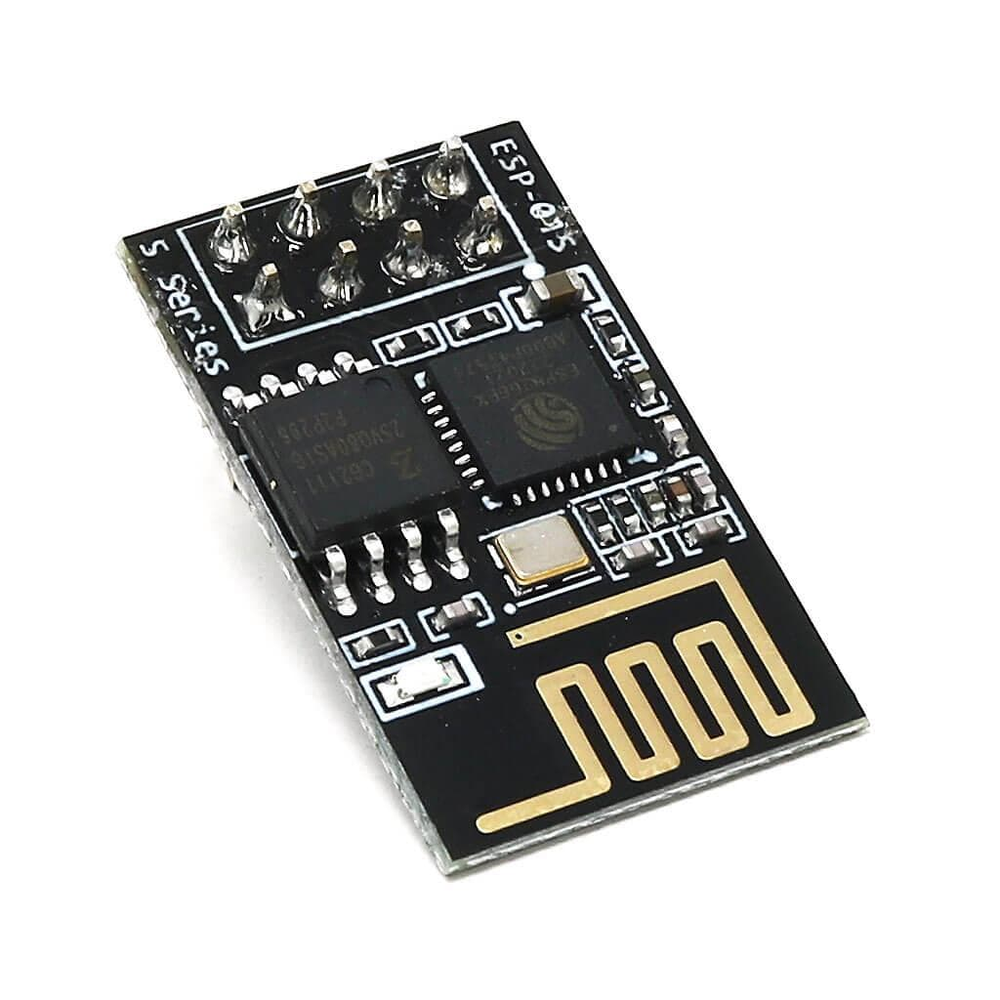
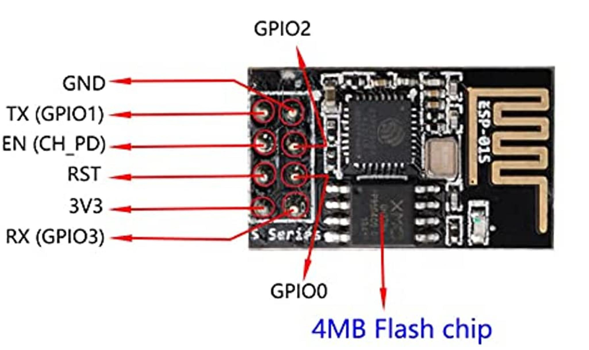

# ESP-01S Serial Remote Controller

This repository contains custom firmware for the ESP-01S that runs a web server,
which hosts a webpage. This webpage allows users to toggle values on a separate
microcontroller that connects via UART.

<div style="text-align: center;">
    
    
    <p align="center"><em>ESP-01S Module </em></p>
</div>

## Flashing

The firmware has been developed using PlatformIO and the Arduino framework. To
flash the firmware, connect the ESP module to a computer using a UART to USB
adapter. The ESP must be in programming mode, this is achived by holding
GPIO0 low during MCU initilization. Once the ESP is ready, flash the firmware
using PlatformIO console tools.

At the moment, this firmware does not implement a Wi-Fi manager, so the firmware
must be re-flashed whenever the Wi-Fi SSID or password changes. To configure the
Wi-Fi credentials, environment variables are used during firmware compilation.

To set the environment variables, run the following commands in the same terminal
session that will be used to compile and flash the firmware.

```console
$ export WIFI_SSID="hello-world"
$ export WIFI_PASSWD="12345678"
```

Alternatively, the Wi-Fi credentials can be defined in the `src/main.cpp` file.

```c
#define WIFI_SSID "hello-world"
#define WIFI_PASSWD "12345678"
```

After setting the credentials, flash the main firmware to the ESP.

```console
$ pio run -t upload
```

Finally upload the files to the LittleFS filesystem.

```console
$ pio run -t uploadfs
```

## LICENSE

This software is licensed under the MIT License. See the [LICENSE](./LICENSE)
file for details.
